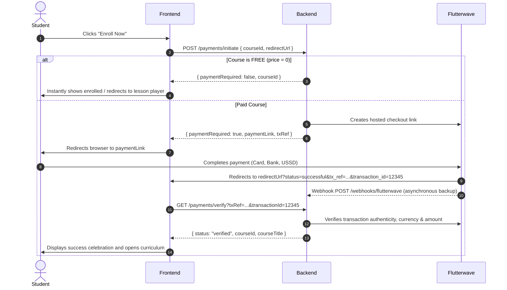
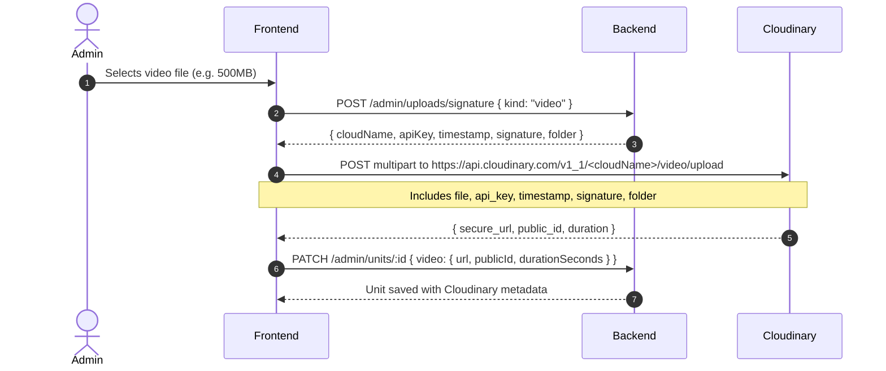

# W3Skool — Frontend API Guide & Integration Contract

> **Target Audience:** React / Vite Frontend Developer (Claude)  
> **Base URL:** `VITE_API_URL` (default: `http://localhost:5000/api/v1`)  
> **Format:** JSON everywhere  
> **Security:** CORS enabled for frontend origin (`CLIENT_URL`); `Authorization` header allowed.

---

## 1. Core Principles & Architecture Boundary

**The backend is the sole source of truth.** The frontend never makes authoritative decisions for:

1. **Course ownership & enrollment:** Determined by `isEnrolled` and `403 NOT_ENROLLED` on protected content.
2. **Sequential lock state:** Calculated by the backend. The frontend displays `status` and `lockedReason`.
3. **Video completion:** Evaluated by the backend based on accumulated reports and required percentages.
4. **Unit completion:** Backend marks completed only when all requirements (video + quiz) are satisfied.
5. **Quiz grading:** **The frontend never calculates or submits scores.** The frontend sends chosen option IDs; the server calculates the score, pass/fail status, and attempt limits.
6. **Payment confirmation:** Frontend initiates and sends redirect result; the server calls Flutterwave to verify amount, currency, and reference before issuing enrollment.
7. **Certificate issuance:** Backend validates complete curriculum completion before generating the unique certificate.

---

## 2. API Envelopes & Conventions

### Authentication
Include the JWT token in all authenticated calls:
```http
Authorization: Bearer <token>
```
- Roles: `student`, `admin`
- On `401 UNAUTHORIZED`, the frontend should log the user out and redirect to `/login`.

### Success Envelope
Every successful response is wrapped in `{ "data": ... }`:
```json
{
  "data": {
    "id": "67a3f890b21a3e...",
    "title": "Modern JavaScript from Scratch"
  }
}
```
*List endpoints return a plain array inside `data` and support `?limit=` (up to 100).*

### Error Envelope
Any HTTP `4xx` or `5xx` response follows:
```json
{
  "error": {
    "code": "UNIT_LOCKED",
    "message": "Complete “HTML Elements” to unlock this lesson.",
    "details": [
      { "field": "email", "message": "An account with this email already exists." }
    ]
  }
}
```
- `error.message` is user-facing plain English. You can render it directly in toasts or banners.
- `error.details` is present on validation errors (`422`).

### Error Codes Reference

| HTTP Code | Error Code | Meaning / Scenario |
|---|---|---|
| `400` | `VALIDATION_ERROR` | Missing required parameters or invalid body format |
| `401` | `UNAUTHORIZED` | Token missing, invalid, or expired |
| `401` | `INVALID_CREDENTIALS` | Bad email or password on login |
| `403` | `FORBIDDEN` | Valid token, but insufficient permissions (e.g. non-admin calling `/admin/*`) |
| `403` | `NOT_ENROLLED` | Student attempted to access course outline/unit without active enrollment |
| `403` | `UNIT_LOCKED` | Lesson is locked by sequential progression rules |
| `403` | `QUIZ_LOCKED` | Quiz is locked because preceding prerequisites are not met |
| `404` | `NOT_FOUND` | Resource (course, unit, quiz, etc.) does not exist |
| `409` | `ALREADY_EXISTS` | Registration with an email that is already registered |
| `409` | `ALREADY_ENROLLED` | Payment initiation for a course the student already owns |
| `409` | `COURSE_HAS_STUDENTS`| Attempted to delete a course with enrolled students (must unpublish instead) |
| `422` | `CANNOT_SELF_COMPLETE`| Attempted manual completion on a unit with video or quiz requirements |
| `429` | `ATTEMPT_LIMIT_REACHED`| Max quiz attempts reached |
| `429` | `RATE_LIMITED` | Too many requests from this IP |
| `502` | `PAYMENT_INIT_FAILED` | Flutterwave API rejected payment initialization |
| `502` | `PAYMENT_VERIFY_FAILED`| Flutterwave verification failure |
| `500` | `SERVER_ERROR` | Internal server error |

---

## 3. Auth Endpoints (`/api/v1/auth`)

### Register
`POST /api/v1/auth/register` (Public)
```json
// Request
{
  "name": "Ada Lovelace",
  "email": "ada@example.com",
  "phone": "+2348012345678",
  "password": "strongPassword123"
}

// Response 201 Created
{
  "data": {
    "token": "eyJhbGciOiJIUzI1Ni...",
    "user": {
      "id": "67a3f890b21a3e...",
      "name": "Ada Lovelace",
      "email": "ada@example.com",
      "role": "student"
    }
  }
}
```

### Login
`POST /api/v1/auth/login` (Public)
```json
// Request
{
  "email": "ada@example.com",
  "password": "strongPassword123"
}

// Response 200 OK
{
  "data": {
    "token": "eyJhbGciOiJIUzI1Ni...",
    "user": {
      "id": "67a3f890b21a3e...",
      "name": "Ada Lovelace",
      "email": "ada@example.com",
      "role": "student"
    }
  }
}
```

### Current User Profile
`GET /api/v1/auth/me` (Auth Required)
```json
// Response 200 OK
{
  "data": {
    "id": "67a3f890b21a3e...",
    "name": "Ada Lovelace",
    "email": "ada@example.com",
    "phone": "+2348012345678",
    "role": "student",
    "avatar": null,
    "lastActiveAt": "2026-10-03T11:00:00.000Z",
    "createdAt": "2026-09-01T08:30:00.000Z"
  }
}
```

---

## 4. Public Course Catalog (`/api/v1/courses`)

### List Published Courses
`GET /api/v1/courses` (Public; optional Auth)
- Query params: `search`, `level` (`beginner|intermediate|advanced`), `featured` (`true|false`), `limit` (max 100)
- If `Authorization: Bearer <token>` is present, `isEnrolled` and `progressPercent` reflect the user's status.

```json
// Response 200 OK
{
  "data": [
    {
      "id": "67a3f890b21a3e...",
      "slug": "javascript-fundamentals",
      "title": "JavaScript Fundamentals",
      "subtitle": "Master modern ECMAScript from zero to hero",
      "thumbnailUrl": "https://res.cloudinary.com/.../thumb.jpg",
      "level": "beginner",
      "durationSeconds": 21600,
      "moduleCount": 6,
      "unitCount": 32,
      "price": 25000,
      "discountPrice": 18000,
      "currency": "NGN",
      "isEnrolled": false,
      "progressPercent": 0
    }
  ]
}
```

### Single Course Detail
`GET /api/v1/courses/:idOrSlug` (Public; optional Auth)
- Works with either MongoDB `id` or string `slug`.
- Curriculum contains titles and preview flags only — **no protected video URLs**.

```json
// Response 200 OK
{
  "data": {
    "id": "67a3f890b21a3e...",
    "slug": "javascript-fundamentals",
    "title": "JavaScript Fundamentals",
    "subtitle": "Master modern ECMAScript",
    "description": "Comprehensive course covering...",
    "thumbnailUrl": "https://res.cloudinary.com/.../thumb.jpg",
    "status": "published",
    "instructor": {
      "name": "Alex Ekwueme",
      "bio": "Senior Fullstack Architect",
      "avatarUrl": "https://..."
    },
    "level": "beginner",
    "durationSeconds": 21600,
    "moduleCount": 6,
    "unitCount": 32,
    "price": 25000,
    "discountPrice": 18000,
    "currency": "NGN",
    "whatYouWillLearn": ["Variables & Scopes", "Async JavaScript", "DOM Manipulation"],
    "requirements": ["Basic computer knowledge"],
    "certificate": {
      "enabled": true,
      "description": "Verified certificate upon completing 100% of units and passing final quiz."
    },
    "liveClasses": {
      "enabled": true,
      "platform": "google_meet",
      "description": "Weekly Q&A sessions on Saturdays at 4 PM.",
      "whatsappAvailable": true
    },
    "hasFinalAssessment": true,
    "curriculum": [
      {
        "id": "mod1",
        "title": "Module 1 — Foundations",
        "units": [
          { "id": "u1", "title": "Introduction & Setup", "durationSeconds": 480, "isPreview": true },
          { "id": "u2", "title": "Variables & Types", "durationSeconds": 920, "isPreview": false }
        ]
      }
    ],
    "enrollment": {
      "isEnrolled": false,
      "progressPercent": 0
    }
  }
}
```

### Free Preview Lesson Video
`GET /api/v1/courses/:courseId/units/:unitId/preview` (Public)
- Only succeeds for units with `isPreview: true`. Returns `403` otherwise.
```json
{
  "data": {
    "id": "u1",
    "title": "Introduction & Setup",
    "video": {
      "url": "https://res.cloudinary.com/w3skool/video/upload/v1/.../intro.mp4"
    }
  }
}
```

---

## 5. Payments & Flutterwave Flow (`/api/v1/payments`)



### 1. Initiate Payment
`POST /api/v1/payments/initiate` (Auth Required)
```json
// Request
{
  "courseId": "67a3f890b21a3e...",
  "redirectUrl": "http://localhost:3000/payment/callback"
}

// Response (Paid Course)
{
  "data": {
    "paymentRequired": true,
    "paymentLink": "https://checkout.flutterwave.com/v3/hosted/pay/...",
    "txRef": "w3s_67a3f890b21a3e_67a30129_1760001234"
  }
}

// Response (Free Course: Price = 0)
{
  "data": {
    "paymentRequired": false,
    "courseId": "67a3f890b21a3e..."
  }
}
```

### 2. Verify Payment (On Callback Page)
`GET /api/v1/payments/verify?txRef=...&transactionId=...` (Auth Required)
- **Safe to call repeatedly:** Idempotent by design. (React StrictMode double-invocations are safely handled).
- The frontend can poll this endpoint every 3 seconds up to 8 times while `status === "pending"`.
```json
// Response 200 OK (Verified)
{
  "data": {
    "status": "verified",
    "courseId": "67a3f890b21a3e...",
    "courseTitle": "JavaScript Fundamentals"
  }
}

// Response 200 OK (Failed)
{
  "data": {
    "status": "failed",
    "courseId": "67a3f890b21a3e...",
    "courseTitle": "JavaScript Fundamentals",
    "message": "Payment was unsuccessful."
  }
}
```

---

## 6. Student Dashboard & Enrolled Courses (`/api/v1/student`)

### Student Dashboard
`GET /api/v1/student/dashboard` (Auth Required)
```json
{
  "data": {
    "continueLearning": {
      "courseId": "67a3f890b21a3e...",
      "courseTitle": "JavaScript Fundamentals",
      "moduleTitle": "Module 2 — Control Flow",
      "unitId": "67a3f910b21a3e...",
      "unitTitle": "Switch Statements & Pattern Matching",
      "progressPercent": 35
    },
    "courses": [ ...list of enrolled courses ],
    "upcomingLive": [ ...up to 5 upcoming live classes for enrolled courses ],
    "achievements": {
      "unitsCompleted": 18,
      "quizzesPassed": 4,
      "coursesCompleted": 1,
      "certificates": 1
    }
  }
}
```
*Note: `continueLearning` is `null` if the student has no enrollments or has finished all courses.*

### Enrolled Courses List
`GET /api/v1/student/courses` (Auth Required)
```json
{
  "data": [
    {
      "id": "67a3f890b21a3e...",
      "slug": "javascript-fundamentals",
      "title": "JavaScript Fundamentals",
      "thumbnailUrl": "https://res.cloudinary.com/.../thumb.jpg",
      "level": "beginner",
      "durationSeconds": 21600,
      "moduleCount": 6,
      "progressPercent": 72,
      "status": "in_progress",
      "resumeUnitId": "67a3f910b21a3e...",
      "certificateAvailable": false
    }
  ]
}
```

---

## 7. Course Curriculum Sidebar (`/api/v1/student/courses/:courseId/outline`)

`GET /api/v1/student/courses/:courseId/outline` (Auth Required)
- Returns `403 NOT_ENROLLED` if the student is not enrolled.
- Drives the sidebar: statuses are `'completed' | 'current' | 'unlocked' | 'locked'`.
- Exactly one unit is `'current'` (the student's active front). Everything after it is `'locked'` with a friendly `lockedReason`.

```json
{
  "data": {
    "course": {
      "id": "67a3f890b21a3e...",
      "title": "JavaScript Fundamentals",
      "progressPercent": 35
    },
    "resumeItem": { "type": "unit", "id": "67a3f910b21a3e..." },
    "certificateAvailable": false,
    "support": {
      "whatsappUrl": "https://chat.whatsapp.com/..."
    },
    "modules": [
      {
        "id": "mod1",
        "title": "Module 1 — Basics",
        "units": [
          { "id": "u1", "title": "Introduction", "status": "completed", "lockedReason": null },
          { "id": "u2", "title": "Variables & Types", "status": "completed", "lockedReason": null }
        ],
        "moduleQuiz": {
          "id": "q1",
          "title": "Module 1 Review Quiz",
          "status": "completed",
          "lockedReason": null
        }
      },
      {
        "id": "mod2",
        "title": "Module 2 — Control Flow",
        "units": [
          { "id": "u3", "title": "If/Else Statements", "status": "current", "lockedReason": null },
          { "id": "u4", "title": "Switch Statements", "status": "locked", "lockedReason": "Complete “If/Else Statements” to unlock this lesson." }
        ],
        "moduleQuiz": {
          "id": "q2",
          "title": "Module 2 Quiz",
          "status": "locked",
          "lockedReason": "Complete all lessons in this module to unlock the quiz."
        }
      }
    ],
    "finalAssessment": {
      "id": "q99",
      "title": "Final Certification Exam",
      "status": "locked",
      "lockedReason": "Complete all lessons to unlock the final assessment."
    }
  }
}
```

---

## 8. Lesson Player & Unit Content (`/api/v1/student/units`)

### Get Unit Content
`GET /api/v1/student/units/:unitId` (Auth Required)
- Returns `403 UNIT_LOCKED` if the lesson is locked.
- Provides the video stream, sanitized teacher guide HTML, downloadable resources, quiz status, completion checklist, and previous/next navigation.

```json
{
  "data": {
    "id": "u3",
    "title": "If/Else Statements",
    "moduleId": "mod2",
    "moduleTitle": "Module 2 — Control Flow",
    "status": "current",
    "video": {
      "url": "https://res.cloudinary.com/w3skool/video/upload/v1/.../lesson3.mp4",
      "thumbnailUrl": null,
      "durationSeconds": 1960,
      "resumePositionSeconds": 850,
      "maxWatchedSeconds": 850,
      "watchedPercent": 43,
      "requiredWatchPercent": 90,
      "seekPolicy": "no_forward",
      "completed": false
    },
    "guide": {
      "format": "html",
      "content": "<h2>Lesson Summary</h2><p>In this lesson, we explore conditional branching...</p>"
    },
    "resources": [
      {
        "id": "r1",
        "title": "Control Flow Cheat Sheet.pdf",
        "type": "pdf",
        "url": "https://res.cloudinary.com/.../cheatsheet.pdf",
        "sizeBytes": 204800
      }
    ],
    "quiz": {
      "id": "q3",
      "required": true,
      "passed": false
    },
    "completion": {
      "completed": false,
      "canMarkComplete": false,
      "requirements": [
        { "key": "video", "label": "Watch at least 90% of the video", "met": false },
        { "key": "quiz", "label": "Pass the quiz", "met": false }
      ]
    },
    "navigation": {
      "previous": { "type": "unit", "id": "u2" },
      "next": {
        "type": "unit",
        "id": "u4",
        "locked": true,
        "lockedReason": "Complete this lesson to unlock the next one."
      }
    }
  }
}
```

### Video Progress Heartbeat
`POST /api/v1/student/units/:unitId/progress` (Auth Required)
- Call this **every 10 seconds** during playback, on video pause, on video ended, and on tab unload.
- Server enforces an anti-cheat cap (reports exceeding total duration are capped; backwards jumps never reduce watched history).
```json
// Request
{
  "positionSeconds": 850,
  "durationSeconds": 1960,
  "maxWatchedSeconds": 850
}

// Response 200 OK
{
  "data": {
    "watchedPercent": 43,
    "videoCompleted": false,
    "unitCompleted": false,
    "completion": {
      "completed": false,
      "canMarkComplete": false,
      "requirements": [
        { "key": "video", "label": "Watch at least 90% of the video", "met": false },
        { "key": "quiz", "label": "Pass the quiz", "met": false }
      ]
    }
  }
}
```
*When `unitCompleted` flips to `true`, the frontend should refetch the course outline to reveal the newly unlocked lesson.*

### Manual Lesson Completion
`POST /api/v1/student/units/:unitId/complete` (Auth Required)
- Only allowed when `completion.canMarkComplete === true` (units with guide only, no video, no quiz).
- Responds with `422 CANNOT_SELF_COMPLETE` if the lesson has unmet video or quiz requirements.
```json
{
  "data": { "completed": true }
}
```

---

## 9. Quizzes & Assessments (`/api/v1/student/quizzes`)

### Get Quiz Questions
`GET /api/v1/student/quizzes/:quizId` (Auth Required)
- `403 QUIZ_LOCKED` if prerequisites are not completed.
- **Never reveals correct answers to students.**
```json
{
  "data": {
    "id": "q3",
    "title": "Control Flow Assessment",
    "passMark": 70,
    "required": true,
    "timeLimitMinutes": null,
    "maxAttempts": 3,
    "attemptsRemaining": 3,
    "passed": false,
    "bestScore": 0,
    "questions": [
      {
        "id": "k1",
        "text": "Which keyword executes code when no condition matches?",
        "type": "single",
        "options": [
          { "id": "opt1", "text": "default" },
          { "id": "opt2", "text": "fallback" },
          { "id": "opt3", "text": "catch" }
        ]
      }
    ]
  }
}
```

### Submit Quiz
`POST /api/v1/student/quizzes/:quizId/submit` (Auth Required)
- The backend grades every question server-side against authoritative answer keys.
```json
// Request
{
  "answers": [
    {
      "questionId": "k1",
      "selectedOptionIds": ["opt1"]
    }
  ]
}

// Response 200 OK
{
  "data": {
    "scorePercent": 100,
    "passed": true,
    "correctCount": 1,
    "totalQuestions": 1,
    "attemptsRemaining": 2,
    "message": "Great job! You passed the quiz.",
    "review": [
      {
        "questionId": "k1",
        "correct": true,
        "explanation": "The 'default' keyword in a switch block executes when no case matches."
      }
    ],
    "unitCompleted": true
  }
}
```
*Note: The review array confirms whether the student was `correct`, but never leaks what the correct option ID was.*

---

## 10. Live Classes (`/api/v1/student/live-sessions`)

`GET /api/v1/student/live-sessions?upcoming=true` (Auth Required)
- Only returns sessions for courses the student is currently enrolled in.
- `joinUrl` remains `null` until **15 minutes before the session starts** (`joinOpensAt`), preventing premature link leakage.
```json
{
  "data": [
    {
      "id": "ls1",
      "courseId": "c1",
      "courseTitle": "JavaScript Fundamentals",
      "title": "Weekend Live Mentorship & Code Review",
      "startsAt": "2026-10-10T15:00:00.000Z",
      "durationMinutes": 60,
      "platform": "google_meet",
      "status": "scheduled",
      "joinUrl": null,
      "joinOpensAt": "2026-10-10T14:45:00.000Z",
      "notes": "Bring your questions about async/await and promises!"
    }
  ]
}
```

---

## 11. Certificates (`/api/v1/student/courses/:courseId/certificate`)

### Claim / View Certificate
`GET /api/v1/student/courses/:courseId/certificate` (Auth Required)
- Checks if all lessons are completed and any final assessments passed.
- Automatically and idempotently generates a unique verification code (`W3S-XXXX-XXXX`).
```json
// When requirements are met:
{
  "data": {
    "available": true,
    "certificate": {
      "id": "cert1",
      "code": "W3S-9E4K-82LQ",
      "studentName": "Ada Lovelace",
      "courseTitle": "JavaScript Fundamentals",
      "instructorName": "Alex Ekwueme",
      "issuedAt": "2026-10-03T12:00:00.000Z",
      "pdfUrl": null,
      "verifyUrl": "http://localhost:3000/verify/W3S-9E4K-82LQ"
    }
  }
}

// When requirements are NOT yet met:
{
  "data": {
    "available": false,
    "reason": "Complete all lessons to earn your certificate."
  }
}
```

### Public Certificate Verification
`GET /api/v1/certificates/verify/:code` (Public, no auth)
- Available to employers, LinkedIn badges, and external viewers.
```json
// Valid Code (200 OK)
{
  "data": {
    "valid": true,
    "certificate": {
      "code": "W3S-9E4K-82LQ",
      "studentName": "Ada Lovelace",
      "courseTitle": "JavaScript Fundamentals",
      "instructorName": "Alex Ekwueme",
      "issuedAt": "2026-10-03T12:00:00.000Z"
    }
  }
}

// Invalid Code (200 OK)
{
  "data": {
    "valid": false
  }
}
```

---

## 12. Direct Cloudinary Upload Flow (Admin)

To eliminate backend bandwidth bottlenecks, videos, images, and PDF resources are uploaded **directly from the browser to Cloudinary**. The backend only generates cryptographic signatures.



### Get Signature
`POST /api/v1/admin/uploads/signature` (Admin Auth)
```json
// Request
{ "kind": "video" } // or "image" or "raw"

// Response 200 OK
{
  "data": {
    "cloudName": "w3skool-cloud",
    "apiKey": "123456789012345",
    "timestamp": 1760001234,
    "signature": "3a8b7c6d5e4f...",
    "folder": "w3skool/videos"
  }
}
```

### Direct Upload via `fetch`
```js
const formData = new FormData();
formData.append('file', file);
formData.append('api_key', signatureData.apiKey);
formData.append('timestamp', signatureData.timestamp);
formData.append('signature', signatureData.signature);
formData.append('folder', signatureData.folder);

const resourceType = kind === 'video' ? 'video' : kind === 'image' ? 'image' : 'raw';

const res = await fetch(`https://api.cloudinary.com/v1_1/${signatureData.cloudName}/${resourceType}/upload`, {
  method: 'POST',
  body: formData,
});
const uploaded = await res.json();
// uploaded.secure_url, uploaded.public_id, uploaded.duration
```

---

## 13. Admin Routes Summary (`/api/v1/admin/*`)

All `/admin/*` endpoints require `Authorization: Bearer <token>` where `user.role === 'admin'`.

| Method | Path | Description |
|---|---|---|
| `GET` | `/admin/stats` | Platform overview: students, revenue, courses, recent payments |
| `GET` | `/admin/courses` | List all courses (drafts, published, archived) with student counts |
| `POST` | `/admin/courses` | Create draft course (`{ title }`) |
| `GET` | `/admin/courses/:id` | Full course details with nested modules & units |
| `PATCH` | `/admin/courses/:id` | Partial update of course metadata, pricing, description |
| `DELETE` | `/admin/courses/:id` | Delete course (rejects with `409` if course has enrolled students) |
| `GET` | `/admin/courses/:id/publish-check` | Validate completeness (returns `{ canPublish, issues }`) |
| `POST` | `/admin/courses/:id/publish` | Publish course (enforces publish checks) |
| `POST` | `/admin/courses/:id/unpublish`| Revert to draft |
| `GET` | `/admin/courses/:id/preview` | Preview course as a student would see it |
| `GET` | `/admin/courses/:courseId/stats`| Per-course enrollment & completion analytics |
| `POST` | `/admin/courses/:courseId/modules`| Add module |
| `PATCH` | `/admin/modules/:id` | Edit module title |
| `DELETE` | `/admin/modules/:id` | Delete module (cascades units, quizzes, resources) |
| `PUT` | `/admin/courses/:courseId/modules/order` | Reorder modules (`{ moduleIds: [...] }`) |
| `POST` | `/admin/modules/:moduleId/units` | Add unit |
| `GET` | `/admin/units/:id` | Get unit details, video metadata, guide, resources |
| `PATCH` | `/admin/units/:id` | Edit unit, video, guide HTML (server-sanitized) |
| `DELETE` | `/admin/units/:id` | Delete unit |
| `PUT` | `/admin/modules/:moduleId/units/order` | Reorder units (`{ unitIds: [...] }`) |
| `POST` | `/admin/units/:unitId/resources` | Attach resource (PDF, cheatsheet, link) |
| `DELETE` | `/admin/resources/:id` | Remove resource |
| `GET` | `/admin/units/:id/quiz` | Get unit quiz (includes `isCorrect` on options) |
| `PUT` | `/admin/units/:id/quiz` | Upsert unit quiz |
| `DELETE` | `/admin/units/:id/quiz` | Delete unit quiz |
| `GET` | `/admin/modules/:id/quiz` | Get module review quiz |
| `PUT` | `/admin/modules/:id/quiz` | Upsert module review quiz |
| `DELETE` | `/admin/modules/:id/quiz` | Delete module review quiz |
| `GET` | `/admin/courses/:id/quiz` | Get course final assessment quiz |
| `PUT` | `/admin/courses/:id/quiz` | Upsert course final assessment quiz |
| `DELETE` | `/admin/courses/:id/quiz` | Delete final assessment quiz |
| `GET` | `/admin/live-sessions` | List all scheduled and past live classes |
| `POST` | `/admin/live-sessions` | Schedule new live class |
| `PATCH` | `/admin/live-sessions/:id` | Edit live class |
| `DELETE` | `/admin/live-sessions/:id` | Cancel live class |
| `GET` | `/admin/students?search=&limit=`| List registered students with enrolled course count |
| `GET` | `/admin/students/:id` | Detailed student drill-down (all courses, progress %, certificate state) |
| `GET` | `/admin/payments?status=&limit=`| List transactions with student name, course title, status |
| `POST` | `/admin/uploads/signature` | Request direct Cloudinary upload signature |

---

## 14. Frontend Golden Rules

1. **Always read from `res.data.data`:** All successful responses wrap the payload in `data`.
2. **Always display `error.message` on failures:** The backend provides friendly, student-facing copy.
3. **Never send a calculated quiz score:** Send `{ answers: [{ questionId, selectedOptionIds }] }`.
4. **Never trust local storage for course enrollment:** Always verify via `isEnrolled` from the API.
5. **Enforce `no_forward` seek policy in UI:** If `seekPolicy === 'no_forward'`, disallow forward seeks past `maxWatchedSeconds` for a polished UX, knowing the backend also prevents fraudulent skips.
6. **Set up environment variable:** Configure `VITE_API_URL=http://localhost:5000/api/v1` in the frontend `.env`.

---

## 20. Platform additions (certificates, analytics, leaderboard, previews)

### GET /student/leaderboard?period=weekly|monthly|overall
Ranked by real points: **10 per completed lesson + 50 per passed quiz**, counted
inside the selected window. Only users with `role = "student"` are ranked;
admins and teachers can view the board but never appear on it.
Res: `{ "period", "scoring": { "perUnit": 10, "perQuiz": 50 }, "entries": [{ "rank", "medal", "id", "name", "points", "unitsCompleted", "quizzesPassed" }], "me": { ... } | null }`

### GET /admin/courses/:courseId/stats
Real course KPIs (MongoDB only, never mock data).
Res: `{ title, totals: { enrolled, completed, inProgress, notStarted, completionRate, averageProgress }, quiz: { attempts, passRate, averageScore }, moduleCount, unitCount }`

### GET /admin/courses/:courseId/students
Roster for one course. Admins/teachers are filtered out by role and never
appear, even if they are somehow enrolled.
Res: `{ course: { id, title, unitCount, moduleCount }, students: [{ id, name, email, progressPercent, status, lastActivityAt, certificateIssued }] }`

### GET /admin/courses/:courseId/students/:studentId
Full performance record: KPIs, module-by-module completion, every quiz attempt
with best score and pass state, plus completion + certificate status.
Res: `{ student, performance, modules: [...], quizzes: [...], certificate }`

### Profiles
- `GET /auth/me` returns the full profile (student and admin).
- Student view aggregates achievements, progress and certificates.
- Admin view adds platform stats (students, published courses, payments, revenue).

### Resource delivery (Cloudinary)
`GET /student/units/:id` and `GET /admin/units/:id` now return, per resource:

```json
{ "id": "…", "title": "Handout.pdf", "type": "pdf", "url": "https://res.cloudinary.com/…",
  "publicId": "w3skool/files/…", "sizeBytes": 71349, "available": true }
```

`available` is a real CDN probe (`probeDelivery`, cached 5 minutes, fails open on
network errors). `false` means Cloudinary will not serve the file (404 = never
stored, 401 = delivery blocked) and the UI explains it instead of opening a blank
viewer.

`POST /admin/units/:id/resources` **verifies before saving**: an unservable
Cloudinary upload is rejected with `422 RESOURCE_UNAVAILABLE` and nothing is
persisted.

### Admin preview isolation
Admins may read course outline/unit/quiz without enrolling (`preview: true` in the
response), but progress, completion and quiz submissions are rejected with
`403 PREVIEW_READ_ONLY`. Video preview never synchronises progress. Admins are
excluded from enrollments, analytics, leaderboards, certificates and participation
data.